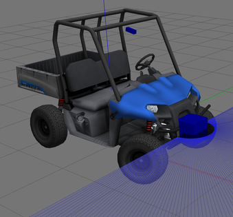

# Разработка модуля управления движением мобильного робота(МР) по траектории
В этой задаче мы будем управлять движением МР в виртуальной среде (Gazebo либо Stage)
В качестве МР выступает модель карта с кинематической схемой автомобиля (Ackerman steering - поворачивающиеся передние колеса)



МР оснащен сканирующим лазерным дальномером и другими датчиками(в Gazebo)

В этой задаче мы не используем данные датчиков, только одометрию и данные о положении робота, которые приходят из симулятора

Управление роботом в этой задаче сводится к управлению поворотом переднего колеса велосипедной модели (топик `/steering` куда можно отправить желаемый угол поворота руля в рад). 
Скорость движения по траектории задается отдельным сообщением (топик `/velocity` куда можно отправить желаемую скорость в м/сек). 

В случае Gazebo за передачу команд управления в модель отвечает vehicle_ros_plugin, а в случае stage команды превращает в управление моделью stage_controller. И в том и в другом случае моделируются ограничения на параметр управления и скорость его изменения (линейное ускорение и скорость вращения рулевого колеса соответственно). То есть если задать угол поворота руля, то он начнет менятся от текущего к заданному с фиксированной скоростью (задается в [лонч файле]() для модели stage ).

```bash
roslaunch simple_controller controller_stage.launch
```
в этом лонче прописан запуск модели с нужными для работы модулями, запуск модуля simple_controller и запуск панели rqt с нужными плагинами, среди которых: задание скорости движения через message_publisher, графики ошибок управления, контролы для настройки регулятора (в текущей реализации).

## Устройство simple_controller
simple_controller управляет движением МР по заданной траектории за счет управления поворотом рулевого колеса (топик /steering). Скорость движения задается извне, в данном случае из rqt (с помощью плагина publish message)
simple_controller реализован в виде класса [Controller](./include/simple_controller/controller.h#L34), часть функций которого является колбеками, вызываемыми библиотекой ros при получении сообщений.
В частности он подписан на сообщения 
- с текущим положением МР [on_pose](./src/controller.cpp#L118)
- обработка таймера [on_timer](.src/controller.cpp#L60), где выполняется вся логика работы модуля: вычислется необходимый угол поворота рулевого колеса в зависимости от положения МР относительно траектории

Модуль публикует:
- управление МР в виде команды поворота переднего колеса с помощью паблишера [steer_pub](./src/controller.cpp#L92)
- текущую ошибку управления (Которую мы можем видеть на графике в rqt) с помощью паблишера [err_pub](./src/controller.cpp#L125)
- траекторию движения в виде облака точек для визуализации в rviz в функции [publish_trajectory](./src/controller.cpp#L181)
- траекторию движения в виде облака точек для визуализации в rviz в функции [publish_trajectory](./src/controller.cpp#L181)

### Траектория движения
В этой задаче траектория движения задается локально в виде набора сегментов с постоянной кривизной: прямых и дуг окружностей. 
<details>
<summary>Подробнее ...</summary>
Программно каждый сегмент представлен в виде объектов класса [CircularSegment](./include/simple_controller/trajectory_segment.h#L39) либо [LinearSegment](./include/simple_controller/trajectory_segment.h#L103), являющихся наследниками класса [TrajectorySegment](./include/simple_controller/trajectory_segment.h#L23), что позволяет работать с разными сегментами единым образом.
Каждый сегмент задается некоторой начальной точку, заданной кривизной, длиной и направлением (определяется ориентацией в начальной точке)

В классах сегментах реализованы следующие функции:
- get_length - возвращает длину сегмента 
- get_curvature - возвращает кривизну текущего сегмента
- get_point(double point_len) - возвращает точку (вектор x, y, z) сегмента на заданной длине от начала (т.е. get_point(0.0) - вернет начальную точку сегмента)
- get_point_length(x, y) - вернет длину сегмента до точки, ближайшей к заданной
- get_point_distance(x,y) - вернет расстояние от заданной точки до ближайшей точки сегмента с учетом направления

Траектория задается как [массив(std::list) trajectory из нескольких сегментов](./src/controller.cpp#L274) в конструкторе контроллера. 
</details>
Траектория образует замкнутый овал.
В конструкторе траектория пересчитывается в сообщение nav_msgs::msgs::Path - стандартное сообщение ROS для задания траектории движения. Также траектория может быть задана за счет соответствующего сообщения, переданного в топик `path`

### Текущее устройство контроллера
Модуль управления движением вдоль траектории реализован в виде ПИД регулятора, входом которого (ошибкой) является расстояние до ближайшей точки траектории, а выходом желаемый угол управления
Начальное положение МР соответствует начальной точке первого сегмента.
Далее в [таймере](./src/controller.cpp#L75) контроллера
-[update_robot_pose](./src/controller.cpp#L27) - обновляется положение МР с учетом полученных данных (последнее положение + скорость * dt)
- [get_nearest_path_pose_index](./src/controller.cpp#L44)  - обновляем индекс ближайшей точки траектории к положению МР. 
- вычисляем ошибку - [расстояние до траектории в координатах ближайшей точки](./src/controller.cpp#L89) Учитываем знак.
- считаем регулятор угловой скорсти
- пересчитываем угловую скорость в кривизну 
- отправляем кривизну в `/stering` (здесь небольшое несоответствие, но на самом деле речь просто о коэффициенте - он переходит в коэффициенты регулятора)
- публикуем траекторию
- публикуем текущую ошибку

### Задача
Переделать модуль управления движением вдоль траектории, реализовав один из алгоритмов, описанных на лекции (базовый вариант - pure pursuite алгоритм преследования маяка). Изменения должны коснуться в основном только функции таймера. Управление должно быть устойчивым на скоростях до 10 м/сек.